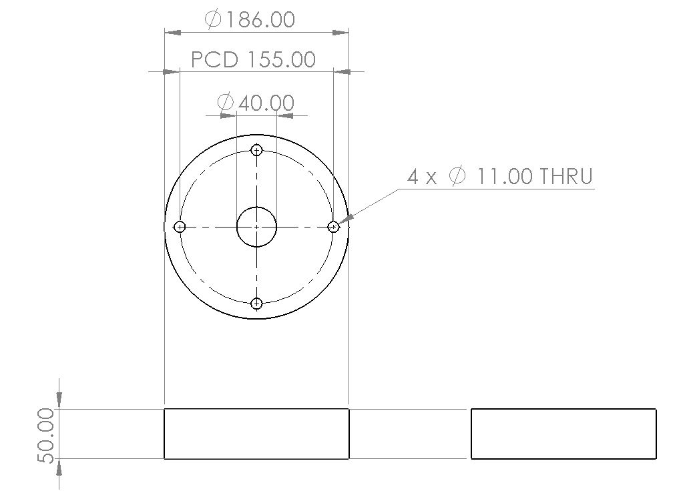

	
	<h1 align="center">Martlet IV Avionics</h1>
	<h3 align="center">Cambridge University Spaceflight</h3>

This repository contains the schematics and firmware for the Martlet IV
Avionics (also known as project Strix). A full up-to-date specification
can be found [here][spec], but all key details are reproduced in this
document.

## Specification
The system must be able to
1. Carry out data acquisition for the Pulsar engine sensors.
2. Perform altimetry for the rocket for the purpose of:
	1. Finding the maximum altitude obtained by the rocket.
	2. Deploying the parachutes*.
3. Store the data obtained from 1. and 2. using a storage device in a
	protective container.
4. Transmit the data obtained from 1. and 2. to a ground station in
	real-time for the purpose of:
	1. Informing the ground support team of the Pulsar engine sensor
		data before launch (i.e. during filling operations).
	2. To aid an investigation should the rocket vehicle suffer an
		in-flight malfunction.
	3. To find out the rocket’s maximum altitude in case loss of
		the rocket prevents retrieval of stored data.

*Note that a commercial off-the-shelf ‘stratologger’ altimeter
	will also be wired to the parachutes and will also be able to
	deploy them for redundancy.
	
	
## Pulsar Engine Sensors
Sensor             | Quantity | Model
------------------ | -------- | --------------------------------------------------------
Pressure Tranducer | 2        | [Omega PXM319-070GI][p_sensor]
Thermocouple       | 4        | [RS Pro K-type welded tip 1/0.315m 5m (762-1118)][t_sensor]

## Design Constraints
The space allowed for the system is shown below (dimensions
in mm):

	

The module must also not take up the entire space; some area or a hole
must be left empty to allow other cables to pass through the rocket
(in addition to the central hole).

The module, including any batteries and mounting hardware, should have
as little mass as possible. It must weigh no more than 500g.

[spec]: https://docs.google.com/document/d/1wuNd2ukuNRVKfNca_YTkUf5Qp6ZxcXcQoBAJ7XX6a5Y
[p_sensor]: https://br.omega.com/omegaFiles/pressure/pdf/PXM309.pdf
[t_sensor]: https://docs.rs-online.com/4918/0900766b815bb169.pdf
